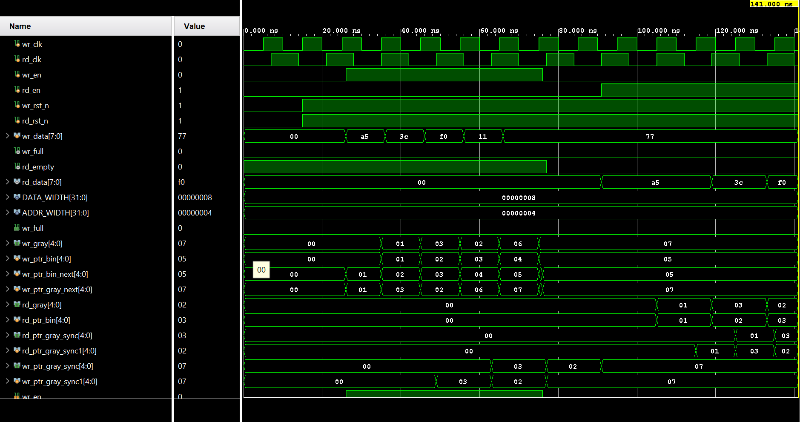

# Asynchronous FIFO

A dual-clock Asynchronous FIFO designed in Verilog HDL for safe data transfer across independent clock domains.

## Features
* Independent write and read clocks (`wr_clk` and `rd_clk`)
* Gray code pointer conversion to prevent multi-bit synchronization hazards
* 2-stage flip-flop synchronizers for clock domain crossing
* Parameterized data width and address depth
* Verified with zero undefined simulation states

## File Structure
* `async_fifo.v` - Top-level module
* `fifo_mem.v` - Dual-port memory block
* `rptr_empty.v` - Read pointer and empty flag logic
* `wptr_full.v` - Write pointer and full flag logic
* `sync_r2w.v` - Read to write domain synchronizer
* `sync_w2r.v` - Write to read domain synchronizer
* `tb_async_fifo.v` - Simulation testbench

## Simulation Waveform
Below is the simulation waveform captured from Xilinx Vivado, showing correct FIFO ordering and flag behavior:

## How to Run
1. Open Xilinx Vivado and create an RTL project.
2. Add all source files and the testbench.
3. Run behavioral simulation.
